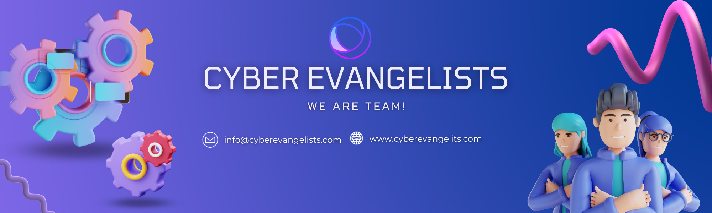

This is the Offical Cyber Evangalists github organizaion! Here you can see our Different Open-Source projects. Feel free to make a pull request and contribute!

## Overview
[Cyber Evangalists](https://cosmodiumcs.com) is a Cyber Security Education Company Created By [Cyber Evangalists Team](https://github.com/PrettyBoyCosmo) and co-founded by [Husnain](https://github.com/wyrdCCS). We make everything from remote access trojans, to discord bots, to an advanced cryptographic framework!

## Members
[Husnain](Hussnaince): **CEO / Chief Executive** 
Started Cosmodium at 17 and since then has made significant changes in the cybersecurity community.

## Resources
Please see the [resources](https://github.com/CosmodiumCS/resources) repository to see a list of tools.

## Support
You can join the [offical discord server]https://discord.com/channels/1037282284962848768/1037282284962848771 for support.
